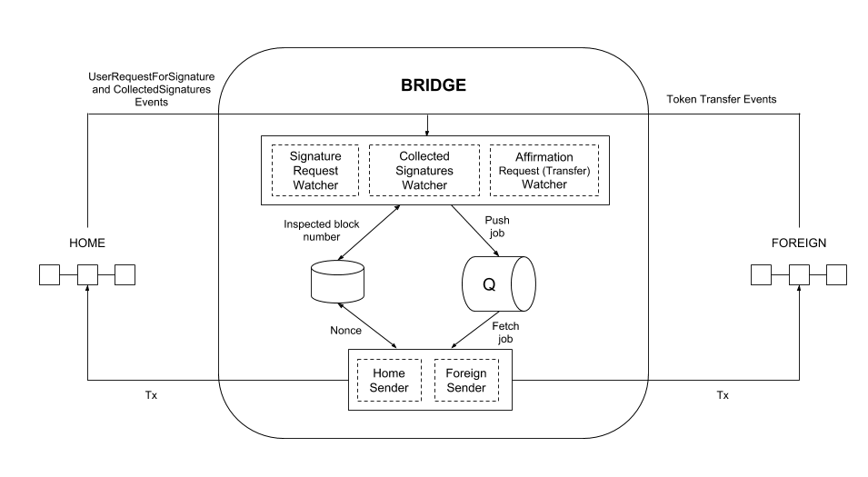

# Sentinel Chain Bridge
Oracle responsible for listening to bridge related events and authorizing asset transfers.

## Overview

The Bridge oracle is deployed on specified validator nodes (only nodes whose private keys correspond to addresses specified in the smart contracts) in the network. It connects to two chains via a Remote Procedure Call (RPC) and is responsible for:
- listening to events related to bridge contracts
- sending transactions to authorize asset transfers

## Architecture

### ERC20-to-ERC20



### Watcher
A watcher listens for a certain event and creates proper jobs in the queue. These jobs contain the transaction data (without the nonce) and the transaction hash for the related event. The watcher runs on a given frequency, keeping track of the last processed block.

If the watcher observes that the transaction data cannot be prepared, which generally means that the corresponding method of the bridge contract cannot be invoked, it inspects the contract state to identify the potential reason for failure and records this in the logs.

There are three Watchers:
- **Signature Request Watcher**: Listens to `UserRequestForSignature` events on the Home network.
- **Collected Signatures Watcher**: Listens to `CollectedSignatures` events on the Home network.
- **Affirmation Request Watcher**: Depends on the bridge mode.
   - `Native-to-ERC20` and `Arbitrary-Message`: Listens to `UserRequestForAffirmation` raised by the bridge contract.
   - `ERC20-to-ERC20` and `ERC20-to-Native`: Listens to `Transfer` events raised by the token contract.

### Sender
A sender subscribes to the queue and keeps track of the nonce. It takes jobs from the queue, extracts transaction data, adds the proper nonce, and sends it to the network.

There are two Senders:
- **Home Sender**: Sends a transaction to the `Home` network.
- **Foreign Sender**: Sends a transaction to the `Foreign` network.

### RabbitMQ

[RabbitMQ](https://www.rabbitmq.com/) is used to transmit jobs from watchers to senders.

### Redis DB

Redis is used to store the number of blocks that were already inspected by watchers, and the NOnce (Number of Operation) which was used previously by the sender to send a transaction.

We also provide [useful commands for development](#useful-commands-for-development).

# How to Use

## Deploy the Bridge Contracts

1. [Deploy the bridge contracts](../../scripts/deploy/README.md)

2. Copy the JSON output generated by the bridge contract deployment process.

## Install and configure the Oracle

1. Create a `.env` file:
```
cp .env.example .env
```

2. Fill in the required information using the JSON output data of the compiled contracts.

## Run the Processes

  - `redis-server` starts Redis. redis-cli ping will return a pong if Redis is running.
  - `rabbitmq-server` starts RabbitMQ. Use rabbitmqctl status to check if RabbitMQ is running.
  - `npm watcher:signature-request`
  - `npm watcher:collected-signatures`
  - `npm watcher:affirmation-request`
  - `npm sender:home`
  - `npm sender:foreign`

## Rollback the Last Processed Block in Redis

If the bridge does not handle an event properly (i.e. a transaction stalls due to a low gas price), the Redis DB can be rolled back. You must identify which watcher needs to re-run. For example, if the validator signatures were collected but the transaction with signatures was not sent to the Foreign network, the `collected-signatures` watcher must look at the block where the corresponding `CollectedSignatures` event was raised.

Execute this command in the bridge root directory:

```shell
bash ./reset-lastBlock.sh <watcher> <block num>
```

where the _watcher_ could be one of:

- `signature-request`
- `collected-signatures`
- `affirmation-request`

## Useful Commands for Development

### RabbitMQ
Command | Description
--- | ---
`rabbitmqctl list_queues` | List all queues
`rabbitmqctl purge_queue home` | Remove all messages from `home` queue
`rabbitmqctl status` | check if rabbitmq server is currently running
`rabbitmq-server`    | start rabbitMQ server

### Redis
Use `redis-cli`

Command | Description
--- | ---
`KEYS *` | Returns all keys
`SET signature-request:lastProcessedBlock 1234` | Set key to hold the string value.
`GET signature-request:lastProcessedBlock` | Get the key value.
`DEL signature-request:lastProcessedBlock` | Removes the specified key.
`FLUSHALL` | Delete all the keys in all existing databases.
`redis-cli ping`     | check if redis is running.
`redis-server`       | start redis server.
